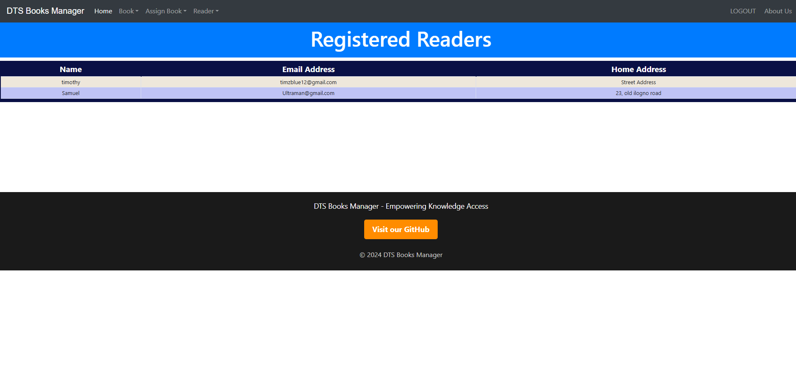

# DTS Books Manager | Your Comprehensive Library Management Solution

__DTS Books Manager -> is a library management web application designed to help library admins efficiently track, manage, and organize book loans and readers in the library. With a robust dual-user interface and a streamlined dashboard, the app provides a simple yet powerful way to handle inventory, track borrowers, and manage library resources seamlessly.__

# Project Description:
__DTS Books Manager is a Django-based web application built to offer libraries an all-encompassing solution for managing book inventory and borrower records. Built on a reliable sqlite3 database and using the SQLAlchemy ORM, DTS Books Manager enables library admins to store, update, and retrieve records effortlessly, while ensuring a user-friendly interface and robust functionality.__

# Key Features:

> Dual-User Interface::
* Admin Dashboard: A fully-featured corporate dashboard for managing library book records, tracking borrowers.
* User-Friendly Inventory Management: An intuitive interface allowing admins to efficiently manage book inventories and borrowing activities.

> Authentication and Authorization:
* Login systems for admins and 
* Secure authentication mechanisms (password hashing and comparison) to protect user credentials.

> Book Management
* Comprehensive Book Records: Supports CRUD operations (Create, Read, Update, Delete) for managing books in the library’s collection.
* Genre and Category Organization: Allows admins to organize books by categories and sub-categories for easy browsing and inventory control.

> Inventory and Borrowing Management
* Track Book Availability: Monitors book inventory levels to keep track of which books are available and which are loaned out.
* Loan and Return Management: Records the issuance and return of books, ensuring accurate records of books currently on loan.

> Dashboard:
* Overview of key library statistics such as books on loan, inventory count.
* Easy Navigation.

# Project Structure:
> Models:
* Defines the database models using Django's ORM to represent products, categories, orders, and inventory entries.

> Storage Engine:
* Django's ORM provides an abstraction layer to interact with the SQLite database, handling CRUD (Create, Read, Update, Delete) operations.

> API Views:
*  Implements the API endpoints using Django's class-based views and REST framework to organize the code based on functionality

> Web Pages:
* Includes Django views for handling user authentication, product management, order processing, and the home page.

> Templates:
* Contains HTML templates for rendering different pages of the application using Django's templating system.

> Static Assets:
* Includes CSS files for styling and JavaScript files for handling frontend interactions (like dynamic updates of inventory information).

# Technology Stack:
> Python:
* The programming language for the backend logic.
> Django:
* The web framework for building the application.
> SQLAlchemy:
* The ORM for database interactions.
> SQLite:
* The database system.
> HTML, CSS, JS:
* Technologies used for frontend development.

# Task Manager (Trello Board):
* https://trello.com/invite/b/AxnETonq/ATTI82aed7718ca2934b7ef087f5d492d70b4132D620/my-portfolio-project

# Project's Screenshots

# Installation
* pip install -r requirement.txt   /to install all the necessary dependencies

* python manage.py makemigrations
  python manage.py migrate
 /To migrate model changes in the app

* python manage.py createsuperuser   /to create an admin user

* python manage.py runserver   /to run the server

# Author:
> Timothy Ofie - [Github](https://github.com/Timzblue12)
